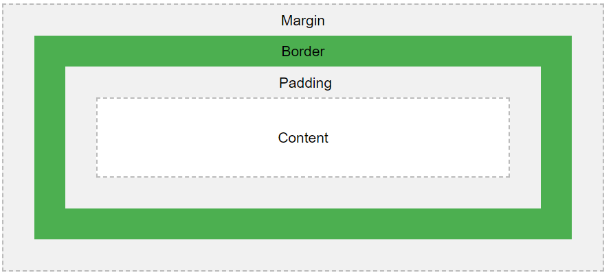
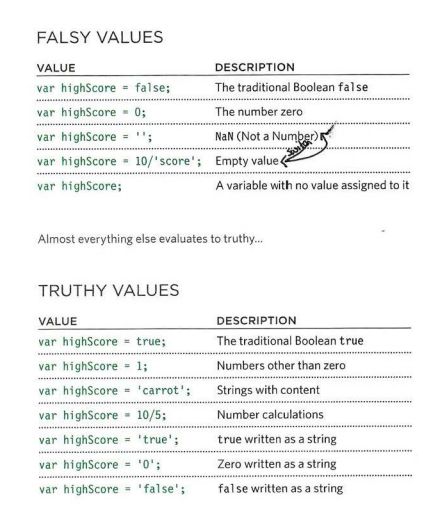

# HTML Lists, CSS Boxes, JS Control Flow
## Lists
HTML provides us with three different types:

* **Ordered lists** are lists where each item in the list is numbered. For example, the list might be a set of steps for a recipe that must be performed in order, or a legal contract where each point needs to be identified by a section number.
* **Unordered lists** are lists that begin with a bullet point (rather than characters that indicate order).
* **Definition lists** are made up of a set of terms along with the definitions for each of those terms.


### Ordered Lists
```
<ol>
The ordered list is created with the <ol> element.
<li>
Each item in the list is placed between an opening <li> tag and a closing </li> tag. (The li stands for list item.)

```
e.g
```

<ol>
<li>Chop potatoes into quarters</li>
<li>Simmer in salted water for 15-20
 minutes until tender</li>
<li>Heat milk, butter and nutmeg</li>
<li>Drain potatoes and mash</li>
<li>Mix in the milk mixture</li>
</ol>
```
result

<ol>
<li>Chop potatoes into quarters</li>
<li>Simmer in salted water for 15-20
 minutes until tender</li>
<li>Heat milk, butter and nutmeg</li>
<li>Drain potatoes and mash</li>
<li>Mix in the milk mixture</li>
</ol>


### Unordered Lists
```
<ul>
The unordered list is created with the <ul> element.
<li>
Each item in the list is placed between an opening <li> tag and a closing </li> tag. (The li stands for list item.)

```
e.g
```
<ul>
<li>1kg King Edward potatoes</li>
<li>100ml milk</li>
<li>50g salted butter</li>
<li>Freshly grated nutmeg</li>
<li>Salt and pepper to taste</li>
</ul>
```
result
<ul>
<li>1kg King Edward potatoes</li>
<li>100ml milk</li>
<li>50g salted butter</li>
<li>Freshly grated nutmeg</li>
<li>Salt and pepper to taste</li>
</ul>

### Definition Lists
```
<dl>
The definition list is created with the <dl> element and usually consists of a series of terms and their definitions.
Inside the <dl> element you will usually see pairs of <dt> and <dd> elements.
<dt>
This is used to contain the term being defined (the definition term).
<dd>
This is used to contain the definition.
```
e.g
```
<dl>
<dt>Sashimi</dt>
<dd>Sliced raw fish that is served with
 condiments such as shredded daikon radish or
 ginger root, wasabi and soy sauce</dd>
<dt>Scale</dt>
<dd>A device used to accurately measure the
 weight of ingredients</dd>
<dd>A technique by which the scales are removed
 from the skin of a fish</dd>
<dt>Scamorze</dt>
<dt>Scamorzo</dt>
<dd>An Italian cheese usually made from whole
 cow's milk (although it was traditionally made
 from buffalo milk)</dd>
</dl>
```
result
<dl>
<dt>Sashimi</dt>
<dd>Sliced raw fish that is served with
 condiments such as shredded daikon radish or
 ginger root, wasabi and soy sauce</dd>
<dt>Scale</dt>
<dd>A device used to accurately measure the
 weight of ingredients</dd>
<dd>A technique by which the scales are removed
 from the skin of a fish</dd>
<dt>Scamorze</dt>
<dt>Scamorzo</dt>
<dd>An Italian cheese usually made from whole
 cow's milk (although it was traditionally made
 from buffalo milk)</dd>
</dl>

### Nested lists
```
You can put a second list inside an <li> element to create a sublist or nested list.
```
e.g
```
<ul>
<li>Mousses</li>
<li>Pastries
 <ul>
 <li>Croissant</li>
 <li>Mille-feuille</li>
 <li>Palmier</li>
 <li>Profiterole</li>
 </ul>
</li>
<li>Tarts</li>
</ul>
```
result
<ul>
<li>Mousses</li>
<li>Pastries
 <ul>
 <li>Croissant</li>
 <li>Mille-feuille</li>
 <li>Palmier</li>
 <li>Profiterole</li>
 </ul>
</li>
<li>Tarts</li>
</ul>
### Summary lists
* There are three types of HTML lists: ordered,
unordered, and definition.
* Ordered lists use numbers.
* Unordered lists use bullets.
* Definition lists are used to define terminology.
* Lists can be nested inside one another.

## Boxes
The CSS Box Model
All HTML elements can be considered as boxes. In CSS, the term "box model" is used when talking about design and layout.

The CSS box model is essentially a box that wraps around every HTML element. It consists of: margins, borders, padding, and the actual content. The image below illustrates the box model:




**Explanation of the different parts:**

**Content** - The content of the box, where text and images appear
**Padding** - Clears an area around the content. The padding is transparent
**Border** - A border that goes around the padding and content
**Margin** - Clears an area outside the border. The margin is transparent

The box model allows us to add a border around elements, and to define space between elements.


## Arrays

JavaScript arrays are used to store multiple values in a single variable.
An array is a special variable, which can hold more than one value at a time.

If you have a list of items (a list of car names, for example), storing the cars in single variables could look like this:

var car1 = "Saab";
var car2 = "Volvo";
var car3 = "BMW";

Creating an Array
Using an array literal is the easiest way to create a JavaScript Array.

Syntax:

var array_name = [item1, item2, ...];  

 ## The else Statement
Use the else statement to specify a block of code to be executed if the condition is false.

if (condition) {
  //  block of code to be executed if the condition is true
} else {
  //  block of code to be executed if the condition is false
}
## Switch Statement
The switch statement is used to perform different actions based on different conditions.

The JavaScript Switch Statement
Use the switch statement to select one of many code blocks to be executed.

```
Syntax
switch(expression) {
  case x:
    // code block
    break;
  case y:
    // code block
    break;
  default:
    // code block
}
```
**This is how it works:**

The switch expression is evaluated once.
The value of the expression is compared with the values of each case.
If there is a match, the associated block of code is executed.
If there is no match, the default code block is executed.

## TRUTHY & FALSY VALUES
*  Falsy values are treated as if they are false. The table  shows a highScore variable with
a series of values, all of which are falsy.
Falsy values can also be treated as the number 0 .

*  Truthy values are treated as if they are true. Almost everything that is not in the falsy table can
be treated as if it were true. Truthy values can also be treated as the number 1. 



## While loop

If you do not know how many times the code should,run you Can use a while loop. Here the condition be something other than a counter and the code will continue to loop for as long as the condition is true. 

`while (condition){statement; update;}`

## The For Loop
The for loop has the following syntax:
```
for (statement 1; statement 2; statement 3) {
  // code block to be executed
}
```
Statement 1 is executed (one time) before the execution of the code block.

Statement 2 defines the condition for executing the code block.

Statement 3 is executed (every time) after the code block has been executed.

## Summary

* Conditional statements allow your code to make
decisions about what to do next.
* Comparison operators (===, ! ==, ==, ! =, <, >, <=, =>) are used to compare two operands.
* Logical operators allow you to combine more than one set of comparison operators.
* if ... else statements allow you to run one set of code if a condition is true, and another if it is false.
* switch statements allow you to compare a value
against possible outcomes (and also provides a default option if none match).
* Data types can be coerced from one type to another.
* All values evaluate to either truthy or falsy.
* There are three types of loop: for, while, and
do ... while. Each repeats a set of statements. 

