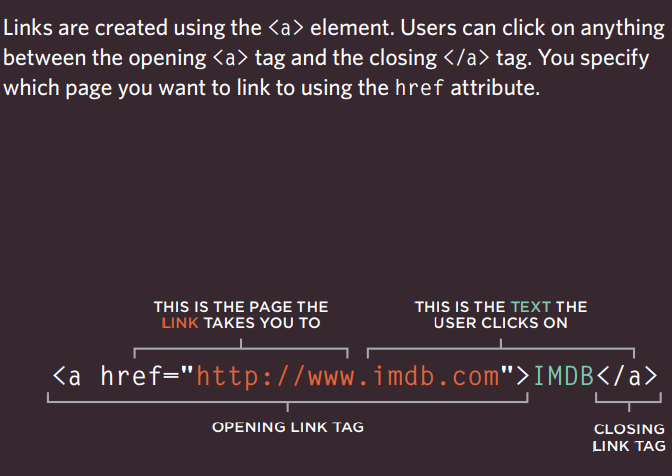
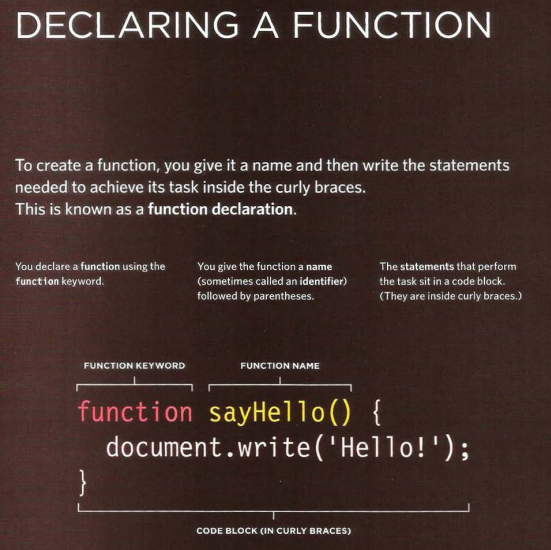
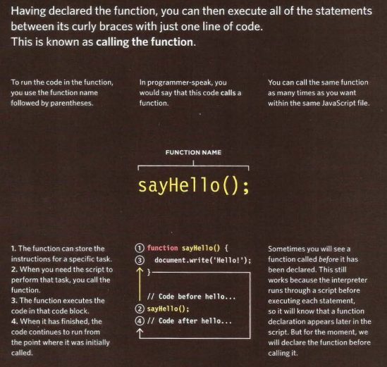

# HTML Links, CSS Layout, JS Functions

## Links

### Types of links
You will commonly come across the following types of links:
● Links from one website to another
● Links from one page to another on the same website
● Links from one part of a web page to another part of the same page
● Links that open in a new browser window
● Links that start up your email program and address a new email to someone
###  Creating links between pages
**Writing Links**


### Linking to Other Sites
```
Links are created using the <a> element which has an attribute called href. The value of the href attribute is the page that you want people to go to when they click on the link.
Users can click on anything that appears between the opening <a> tag and the closing </a> tag and will be taken to the page specified in the href attribute.
When you link to a different website, the value of the href attribute will be the full web address for the site, which is known as an absolute URL.
```
<br
>
E.g html 
<br>

```
<p>Movie Reviews:
<ul>
 <li><a href="http://www.empireonline.com">
 Empire</a></li>
 <li><a href="http://www.metacritic.com">
 Metacritic</a></li>
 <li><a href="http://www.rottentomatoes.com">
 Rotten Tomatoes</a></li>
 <li><a href="http://www.variety.com">
 Variety</a></li>
</ul>
</p

```
<br>

result

<p>Movie Reviews:
<ul>
 <li><a href="http://www.empireonline.com">
 Empire</a></li>
 <li><a href="http://www.metacritic.com">
 Metacritic</a></li>
 <li><a href="http://www.rottentomatoes.com">
 Rotten Tomatoes</a></li>
 <li><a href="http://www.variety.com">
 Variety</a></li>
</ul>
</p

### Linking to Other Pages on the Same Site

<br>

```
<a>
When you are linking to other pages within the same site, you do not need to specify the domain name in the URL. You can use a shorthand known as a
relative URL.
If all the pages of the site are in the same folder, then the value of the href attribute is just the name of the file.
```
<br>

e.g html

```
<p>
<ul>
 <li><a href="index.html">Home</a></li>
 <li><a href="about-us.html">About</a></li>
 <li><a href="movies.html">Movies</a></li>
 <li><a href="contact.html">Contact</a></li>
</ul>
</p
```
<br>
result
<p>
<ul>
 <li><a href="index.html">Home</a></li>
 <li><a href="about-us.html">About</a></li>
 <li><a href="movies.html">Movies</a></li>
 <li><a href="contact.html">Contact</a></li>
</ul>
</p>

<br>


### Email Links

<br>
```
mailto: 
To create a link that starts up the user's email program and addresses an email to a specified
email address, you use the <a> element. However, this time the value of the href attribute starts with mailto: and is followed by the email address you want the email to be sent to.

e.g html
<a href="mailto:jon@example.org">Email Jon</a>

<br>

```
result
<a href="mailto:jon@example.org">Email Jon</a>

### Opening Links in a New Window

```

target
If you want a link to open in a new window, you can use the target attribute on the opening <a> tag. The value of this attribute should be _blank.
One of the most common reasons a web page author might want a link to be opened in a new window is if it points to another website. In such cases, they hope the user will return to the window containing their site after finishing looking at the
other one.
Generally you should avoid opening links in a new window, but if you do, it is considered good practice to inform users that the link will open a new window before they click on it

e.g html
<a href="http://www.imdb.com" target="_blank">
Internet Movie Database</a> (opens in new window)
```
<a href="http://www.imdb.com" target="_blank">
Internet Movie Database</a> (opens in new window)

### Summary links

```
* Links are created using the <a> element.
* The <a> element uses the href attribute to indicate
the page you are linking to.
* If you are linking to a page within your own site, it is
best to use relative links rather than qualified URLs.
*  You can create links to open email programs with an
email address in the "to" field.
* You can use the id attribute to target elements within
a page that can be linked to.
```
## Layout
A website is often divided into headers, menus
content and a footer:

* A header is usually located at the top of the website (or right below a top navigation menu). It often contains a logo or the website name
* <div> elements are often used as containing elements to group together sections of a page.
* Browsers display pages in normal flow unless you
specify relative, absolute, or fixed positioning.
* The float property moves content to the left or right of the page and can be used to create multi-column layouts. (Floated items require a defined width.)
* Pages can be fixed width or liquid (stretchy) layouts.
*  Designers keep pages within 960-1000 pixels wide,
and indicate what the site is about within the top 600 pixels (to demonstrate its relevance without scrolling).
* Grids help create professional and flexible designs.
* CSS Frameworks provide rules for common tasks.
* You can include multiple CSS files in one page.


## FUNCTION

## WHAT IS A FUNCTION?

Functions let you group a series of statements together to perform a specific task. If different parts of a script repeat the same task, you can reuse the function (rather than repeating the same set of statements). 

## Declaring a fanction





## Caling a function


##  A function statement

A function statement starts with the function keyword. It can return a primitive type value, object, or another function. For example, a function statement can return an object as shown in the following code example:
<br>

>function getProduct(){
    let product = {
        Id:1,
        Title:'Book',
        Price: 30
    };
    return product; 
}
let p1 = getProduct();
>console.log(p1); // prints product object

<br>

## A Function as an Expression


A function as an expression can be created as shown in the following code example.
>let add = function a(num1,num2){
    let sum = num1+ num2; 
    return sum;
}
let res = add(8,9);
>console.log(res);// 17
