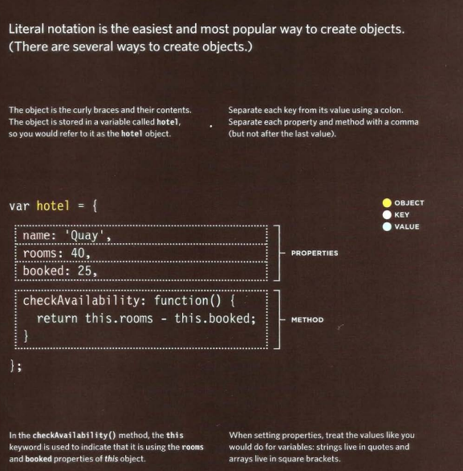
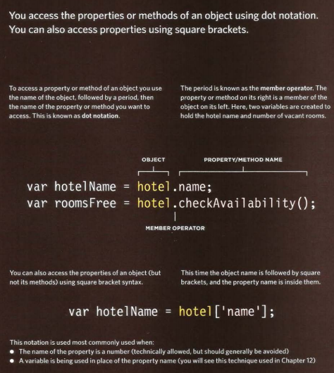

# Problem Domain, Objects, and the DOM

## The problem domain.

**What is the hardest thing about writing code?**

* Learning a new technology
* Naming things
* Testing your code
* Debugging
* Fixing bugs
* Making software maintainable

**What can you do about it?**
If understanding the problem domain is the hardest part of programming and you want to make programming easier, you can do one of two things:

* Make the problem domain easier
* Get better at understanding the problem domain
You can often make the problem domain easier by cutting out cases and narrowing your focus to a particular part of the problem.

What I mean by this is that it is often beneficial to take a part of the problem and fully understand that part before expanding the problem domain.

The other choice is to become better at understanding problem domains.  As developers, we tend to think that sitting down and talking to customers or business people who know about the problem domain is a waste of time. It is easy to fall into the trap of thinking you understand enough of the problem to get started coding it.  Best to resist the temptation to “not waste anymore time talking” and make sure you understand a problem inside and out before you try and solve it with code.  It is much more expensive and time consuming to do things over than it is to do them right the first time.  I learn this lesson the hard way time and time again.

## Objects

### WHAT IS AN OBJECT?

Objects group together a set of variables and functions to create a model of a something you would recognize from the real world. 
In an object, variables and functions take on new names. 

**IN AN OBJECT: VARIABLES BECOME KNOWN AS PROPERTIES**
If a variable is part of an object, it is called a
property. Properties tell us about the object, such as the name of a hotel or the number of rooms it has.
Each individual hotel might have a different name  and a different number of rooms. 

**IN AN OBJECT: FUNCTIONS BECOME KNOWN AS METHODS**
If a function is part of an object, it is called a method.
Methods represent tasks that are associated with the object. For example, you can check how many rooms are available by subtracting the number of booked rooms from the total number of rooms. 

**In JavaScript, almost "everything" is an object.**

* Booleans can be objects (if defined with the new keyword)
* Numbers can be objects (if defined with the new keyword)
* Strings can be objects (if defined with the new keyword)
* Dates are always objects
* Maths are always objects
* Regular expressions are always objects
* Arrays are always objects
* Functions are always objects
* Objects are always objects
***All JavaScript values, except primitives, are objects(string, number, boolean, null,undefined)***

**There are different ways to create new objects:**

* Define and create a single object, using an object literal.
* Define and create a single object, with the keyword new.
* Define an object constructor, and then create objects of the constructed type.

**CREATING OBJECTS USING LITERAL NOTATION**

**CREATING OBJECTS USING AND DOT NOTATION**

## Document Object Model

**What is the DOM?**
The DOM is a W3C (World Wide Web Consortium) standard.

The DOM defines a standard for accessing documents:

"The W3C Document Object Model (DOM) is a platform and language-neutral interface that allows programs and scripts to dynamically access and update the content, structure, and style of a document."

The W3C DOM standard is separated into 3 different parts:

* Core DOM - standard model for all document types
* XML DOM - standard model for XML documents
* HTML DOM - standard model for HTML documents

**What is the HTML DOM?**
The HTML DOM is a standard object model and programming interface for HTML. It defines:

* The HTML elements as objects
* The properties of all HTML elements
* The methods to access all HTML elements
* The events for all HTML elements

***In other words: The HTML DOM is a standard for how to get, change, add, or delete HTML elements.***

With the HTML DOM, JavaScript can access and change all the elements of an HTML document.

When a web page is loaded, the browser creates a Document Object Model of the page.

The HTML DOM model is constructed as a tree of Objects:

**With the object model, JavaScript gets all the power it needs to create dynamic HTML:**

* JavaScript can change all the HTML elements in the page
* JavaScript can change all the HTML attributes in the page
* JavaScript can change all the CSS styles in the page
* JavaScript can remove existing HTML elements and attributes
* JavaScript can add new HTML elements and attributes
* JavaScript can react to all existing HTML events in the page
* JavaScript can create new HTML events in the page

