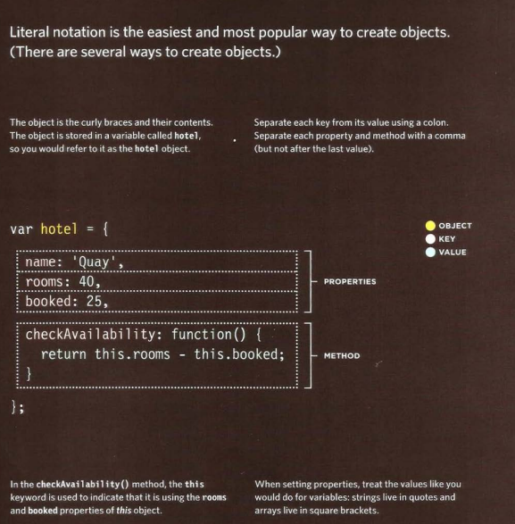

# HTML Tables; JS Constructor FunctionsDefine an HTML Table


## Domain modeling
Domain modeling is the process of creating a conceptual model for a specific problem. And a domain model that's articulated well can verify and validate your understanding of that problem.

Here's some tips to follow when building your own domain models.

* When modeling a single entity that'll have many instances, build self-contained objects with the same attributes and behaviors.
* Model its attributes with a constructor function that defines and initializes properties.
* Model its behaviors with small methods that focus on doing one job well.
* Create instances using the new keyword followed by a call to a constructor function.
* Store the newly created object in a variable so you can access its properties and methods from outside.
* Use the this variable within methods so you can access the object's properties and methods from inside.

## Tables

The `<table>` tag defines an HTML table.

Each table row is defined with a `<tr>` tag. Each table header is defined with a `<th>` tag. Each table data/cell is defined with a `<td>` tag.

By default, the text in `<th> `elements are bold and centered.

By default, the text in `<td>` elements are regular and left-aligned.

**Spanning ColumnS**
HTML Table - Cell that Spans Many Columns
To make a cell span more than one column, use the `colspan` attribute

**Spanning Rows**
HTML Table - Cell that Spans Many Rows
To make a cell span more than one row, use the rowspan attribute
The <thead> tag is used to group header content in an HTML table.

The <thead> element is used in conjunction with the <tbody> and <tfoot> elements to specify each part of a table (header, body, footer).

Browsers can use these elements to enable scrolling of the table body independently of the header and footer. Also, when printing a large table that spans multiple pages, these elements can enable the table header and footer to be printed at the top and bottom of each page.
<br>
**Long Tables**
There are three elements that help distinguish between the main content of the table and
the first and last rows (which can contain different content).
These elements help people who use screen readers and also allow you to style these sections in a different manner than the rest of the table 

```
<thead>
The headings of the table should
sit inside the <thead> element.
```

<br>
```
<thead>
The headings of the table should
sit inside the <thead> element.
```

<br>
```
<tfoot>
The footer belongs inside the
<tfoot> element.
By default, browsers rarely treat
the content of these elements
any differently than other
elements however designers
often use CSS styles to change
their appearance.
```
<br>

## FUNCTION

## WHAT IS A FUNCTION?

Functions let you group a series of statements together to perform a specific task. If different parts of a script repeat the same task, you can reuse the function (rather than repeating the same set of statements). 

## Declaring a fanction


## Caling a function


##  A function statement

A function statement starts with the function keyword. It can return a primitive type value, object, or another function. For example, a function statement can return an object as shown in the following code example:
<br>

>function getProduct(){
    let product = {
        Id:1,
        Title:'Book',
        Price: 30
    };
    return product; 
}
let p1 = getProduct();
>console.log(p1); // prints product object

<br>

## A Function as an Expression


A function as an expression can be created as shown in the following code example.
>let add = function a(num1,num2){
    let sum = num1+ num2; 
    return sum;
}
let res = add(8,9);
>console.log(res);// 17


## Objects

### WHAT IS AN OBJECT?

Objects group together a set of variables and functions to create a model of a something you would recognize from the real world. 
In an object, variables and functions take on new names. 

**IN AN OBJECT: VARIABLES BECOME KNOWN AS PROPERTIES**
If a variable is part of an object, it is called a
property. Properties tell us about the object, such as the name of a hotel or the number of rooms it has.
Each individual hotel might have a different name  and a different number of rooms. 

**IN AN OBJECT: FUNCTIONS BECOME KNOWN AS METHODS**
If a function is part of an object, it is called a method.
Methods represent tasks that are associated with the object. For example, you can check how many rooms are available by subtracting the number of booked rooms from the total number of rooms. 


**In JavaScript, almost "everything" is an object.**

* Booleans can be objects (if defined with the new keyword)
* Numbers can be objects (if defined with the new keyword)
* Strings can be objects (if defined with the new keyword)
* Dates are always objects
* Maths are always objects
* Regular expressions are always objects
* Arrays are always objects
* Functions are always objects
* Objects are always objects
***All JavaScript values, except primitives, are objects(string, number, boolean, null,undefined)***

**There are different ways to create new objects:**

* Define and create a single object, using an object literal.
* Define and create a single object, with the keyword new.
* Define an object constructor, and then create objects of the constructed type.

**CREATING OBJECTS USING LITERAL NOTATION**



**CREATING OBJECTS USING AND DOT NOTATION**


## Methods
JavaScript methods are actions that can be performed on objects.

A JavaScript method is a property containing a function definition.
Accessing Object Methods
You access an object method with the following syntax:

`objectName.methodName()`
You will typically describe fullName() as a method of the person object, and fullName as a property.

The fullName property will execute (as a function) when it is invoked with ().

The this Keyword
In a function definition, this refers to the "owner" of the function.

In the example above, this is the person object that "owns" the fullName function.

In other words, this.firstName means the firstName property of this object.


