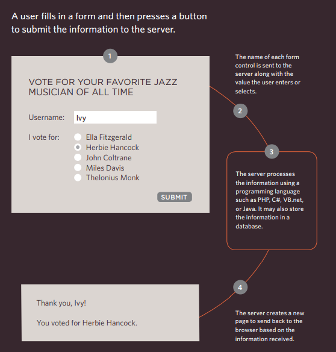
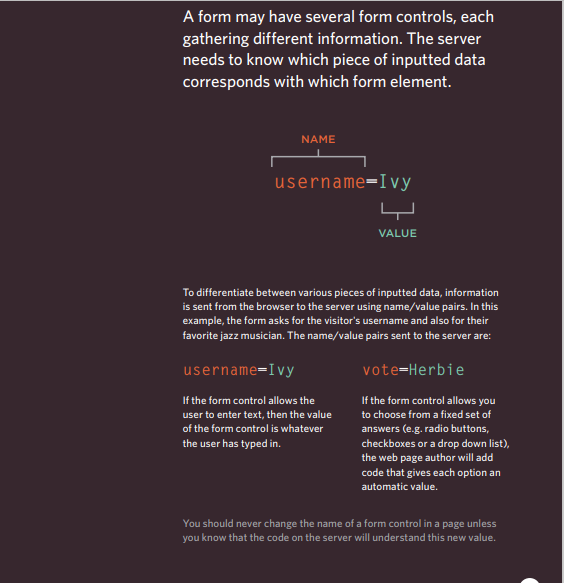
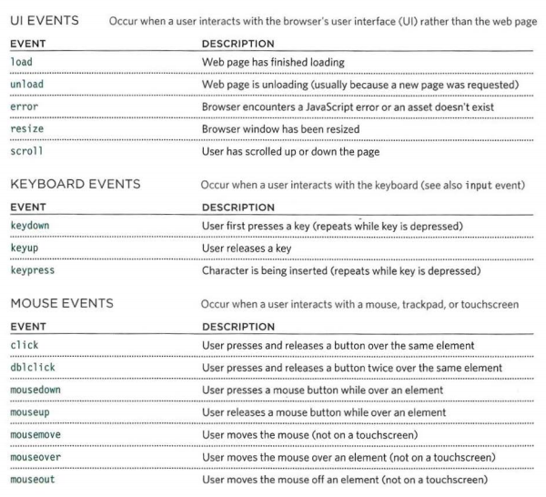

# Forms and Events

## Forms

**HTML froms are elements that allow you to collect information from visitors to your site.**

**Form Controls:**

* adding text

* making choices

* submitting forms

* uploading files

**How forms work?**

**Form summary**
* Whenever you want to collect information from
visitors you will need a form, which lives inside a
`<form>` element.
*  Information from a form is sent in name/value pairs.
* Each form control is given a name, and the text the
user types in or the values of the options they select
are sent to the server.
* HTML5 introduces new form elements which make it
easier for visitors to fill in forms.

## Lists, Tables and Forms
there are several others that are specifically used to
control the appearance of lists, tables, and forms.
* List markers can be given different appearances
using the `list-style-type` and `list-style` image
properties.
* Table cells can have different borders and spacing in
different browsers, but there are properties you can
use to control them and make them more consistent.
* Forms are easier to use if the form controls are
vertically aligned using CSS.
* Forms benefit from styles that make them feel more
interactive.

## Event 

HTML events are "things" that happen to HTML elements.

When JavaScript is used in HTML pages, JavaScript can "react" on these events.
An HTML event can be something the browser does, or something a user does.

**Here are some examples of HTML events:**

* An HTML web page has finished loading
* An HTML input field was changed
* An HTML button was clicked

Here is a selection of the events that occur in the browser while you are
browsing the web. Any of these events can be used to trigger a function
in your JavaScript code.

**Summery**
* Events are the browser's way of indicating when
something has happened (such as when a page has
finished loading or a button has been clicked).
* Binding is the process of stating which event you are
waiting to happen, and which element you are waiting
for that event to happen upon.
* When an event occurs on an element, it can trigger a
JavaScript function. When this function then changes
the web page in some way, it feels interactive because
it has responded to the user.
* You can use event delegation to monitor for events
that happen on all of the children of an element.
* The most commonly used events are W3C DOM
events, although there are others in the HTMLS
specification as well as browser-specific events. 