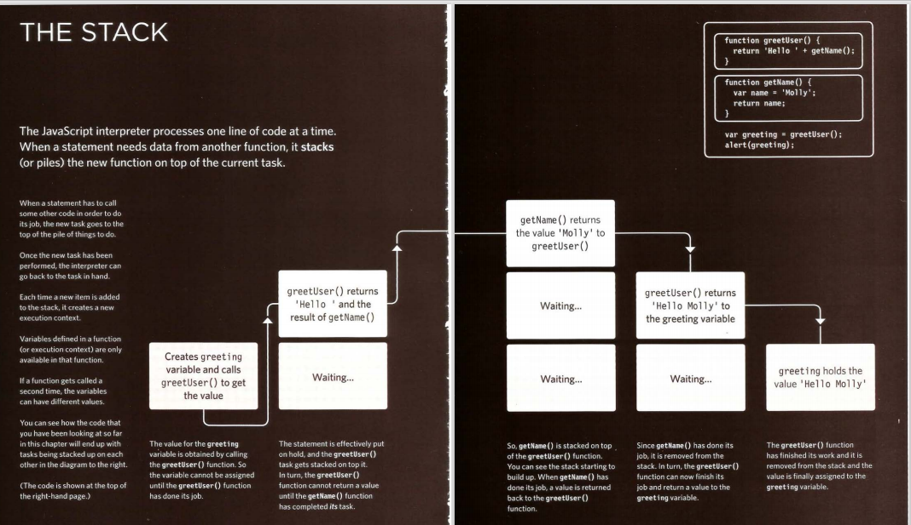
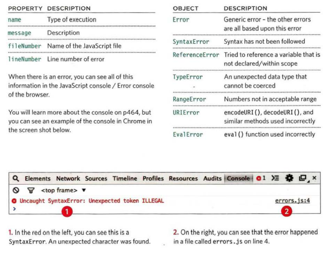

# JS Debugging

## ORDER OF EXECUTION
The order in which statements are executed can be complex; some tasks cannot complete until another statement or function has been run:

## UNDERSTANDING SCOPE
each execution context has its own va ri ables object.
It holds the variables, functions, and parameters available within it.
Each execution context can also access its parent's variables object. 

## ERROR OBJECTS 
Error objects can help you find where your mistakes are
and browsers have tools to help you read them.

**Summary**
* If you understand execution contexts (which have two
stages) and stacks, you are more likely to find the error in your code.
* Debugging is the process of finding errors. It involves a process of deduction.
* The console helps narrow down the area in which the
error is located, so you can try to find the exact error.
* JavaScript has 7 different types of errors. Each creates its own error object, which can tell you its line number and gives a description of the error.

* If you know that you may get an error, you can handle
it gracefully using the try, catch, finally statements.
Use them to give your users helpful feedback. 
