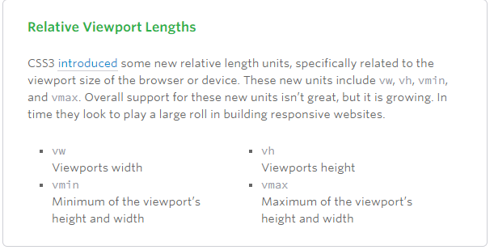

#  RESPONSIVE WEB DESIGN and FLOATS

## Responsive Web Design RWD

Responsive web design is the practice of building a website suitable to work on every device and every screen size, no matter how large or small, mobile or desktop. Responsive web design is focused around providing an intuitive and gratifying experience for everyone. Desktop computer and cell phone users alike all benefit from responsive websites.

## Responsive vs. Adaptive vs. Mobile
* Responsive generally means to react quickly and positively to any change (continually and fluidly change based on different factors, such as viewport width)
* Adaptive means to be easily modified for a new purpose or situation, such as change respond to preset factors
* Mobile means to build a separate website only for mobile users
## components of RWD:
Responsive web design is broken down into three main components, including flexible layouts, media queries, and flexible media

* flexible layouts
* media queries
* flexible media

### Flexible layouts

 The practice of building the layout of a website with a flexible grid, capable of dynamically resizing to any width. Flexible grids are built using relative length units, most commonly percentages or em units. These relative lengths are then used to declare common grid property values such as width, margin, or padding.

#### Proportions of a Flexible Layout Formula (using relative values):
* Taking the target property value of an element
* Dividing it by the width of it’s parent element
* The result is the relative property value of the target element

> target ÷ context = result

### Media Queries
Media queries are used when the width of a browser viewport is so small that even scaling  the layout proportionally doesn’t work properly

apply targeted styles - specify different styles for individual browser and device circumstances (i.e. width of the viewport, device orientation)

### Flexible Media
Flexible media is used for images, videos, and other media types that need to be scalable, changing their size as the size of the viewport changes

using the max-width property with a value of 100%

## CSS Floats
float is a CSS positioning property used for elements to remain a part of the flow of the web page (other elements wrap around floated elements)
**Float property takes 4 values:**
* left
* right
* none
* inherent
floats can be used to wrap text around images, or create entire web layouts or small instances layout

## Clearing Floats

clear is a CSS property used usually with float
cleared elements will not wrap around floated elements, but will move down past the floated elements
**Clear property takes 4 values:**
* both (clears floats coming from left and right)
* left
* right
* none
### The Great Collapse
floated elements can affect the parent element that contains them
if a parent element contains only floats, the height of it would collapse to nothing
collapsing effects problems are fixed by clearing the float after the floated elements in the container but before the close of the container
## Techniques for Clearing Floats:
* The Empty Div Method
` 

`
* The Overflow Method setting the overflow CSS property on a parent element to auto or hidden, which clears succeeding elements and the parent will expand to contain the floats
* The Easy Clearing Method using the CSS pseudo selector :after to clear floats
