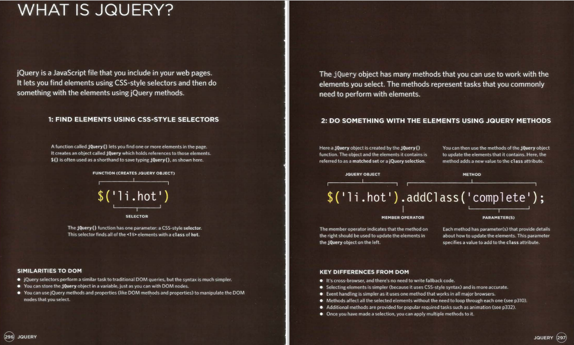
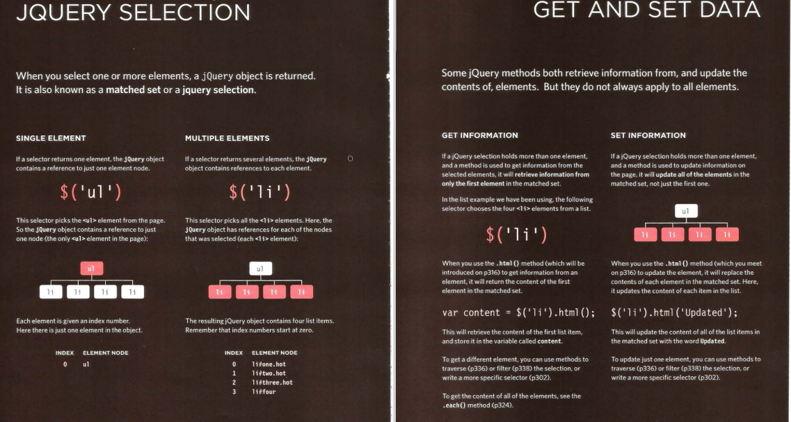

 # jQuery, Events, and The DOM

jQuery offers a simple way to achieve a variety of common  JavaScript tasks quickly and consistently, across all major  browsers and without any fallback code needed. 

* jQuery is a JavaScript Library.

* jQuery greatly simplifies JavaScript programming.

* jQuery is easy to learn.

**SELECT ELEMENTS** 
It is simpler to access elements using jQuery's 
CSS-style selectors than it is using DOM queries. The selectors are also more powerful and flexible

**PERFORM TASKS**
jQuery's methods let you update the DOM tree, animate elements into and out of view, and loop through a set of elements, all in one line of code. 

**HANDLE EVENTS**
jQuery includes methods that allow you to attach event listeners to selected elements without having to write any tailback code to support older browsers. 

## WHY USE JQUERY? 
1: SIMPLE SELECTORS 
As you saw in Chapter 5, which introduced the 
DOM, it is not always easy to select the elements 
that you want to. For example: 
• Older browsers do not support the latest 
methods for selecting elements. 
• IE does not treat whitespace between elements 
as text nodes, while other browsers do. 
Such issues make it hard to select the right elements 
on a page across all major browsers. 
Rather than learn a new way to select elements, 
jQuery uses a language that is already familiar to 
front-end web developers: CSS selectors. They: 
• Are much faster at selecting elements 
• Can be a lot more accurate about which elements 
to select 
• Often require a lot less code than older DOM 
methods 
• Are already used by most front-end developers 
2: COMMON TASKS IN LESS CODE 
There are some tasks that front-end developers 
need to do regularly, such as loop through the 
elements that have been selected. 
jQuery has methods that offer web developers 
simpler ways to perform common tasks, such as: 
• loop through elements 
• Add I remove elements from the DOM tree 
• Handle events 
• Fade elements into I out of view 
• Handle Ajax requests 
3: CROSS-BROWSER COMPATIBILITY 
jQuery automatically handles the inconsistent ways  in which browsers select elements and handle events, so you do not need to write cross-browser  fallback code 

## jQuery selection
a jQuery object is returned when one or more elements are selected

* .html() method used to return or replace the content of an element
* .text() method used to return or replace the text content of an element
* jQuery objects store references to the nodes in the DOM tree that corresponds to the selected element
* cashing a jQuery object stores a reference to it in a variable
with jQuery there's no need to use looping
* .ready() method checks if the page is loaded and ready to work with jQuery code
* append(): inserts content at the end of the selected elements.
* prepend(): inserts content at the beginning of the selected elements.
* after(): inserts content after the selected elements.
* before(): inserts content before the selected elements.
* attr(): sets or returns the value of attributes.
* removeAttr(): removes the specified attribute.

# Reasons for pair programming:
Greater efficiency
Engaged collaboration
Learning from fellow students
Social skills
Job interview readiness
Work environment readiness