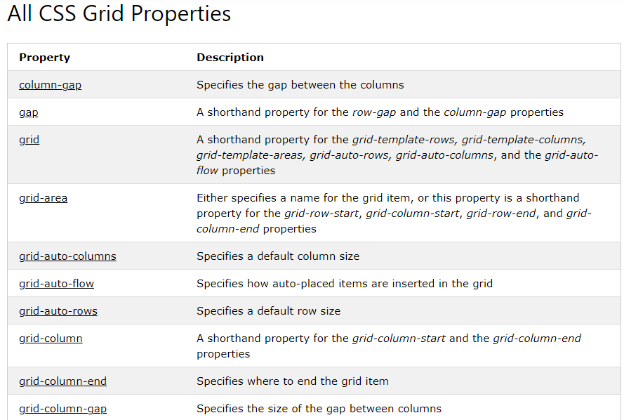
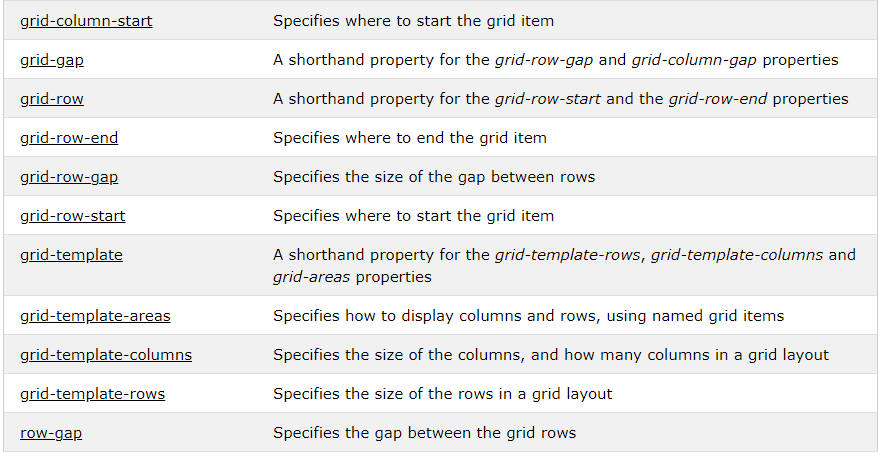

 ## Responsive design with CSS Grid
The CSS Grid Layout Module offers a grid-based layout system, with rows and columns, making it easier to design web pages without having to use floats and positioning.

  **grid**  generates a block-level grid
**inline-grid** generates an inline-level grid
 **grid-template-columns & grid-template-rows:** Defines the columns and rows of the grid with a space-separated list of values. The values represent the track size, and the space between them represents the grid line.  
  **Display Property**
An HTML element becomes a grid container when its display property is set to grid or inline-grid.
`.grid-container {`
 ` display: grid;}`

## Grid Columns
The vertical lines of grid items are called columns.
## Grid Rows
The horizontal lines of grid items are called rows.

## Grid Gaps
The spaces between each column/row are called gaps.
You can adjust the gap size by using one of the following properties:

* `grid-column-gap` sets the gap between the columns:
* `grid-row-gap`sets the gap between the rows
* `grid-gap` The grid-gap property is a shorthand property for the grid-row-gap and the grid-column-gap properties

## Grid Lines
The lines between columns are called column lines.

The lines between rows are called row lines.
 

## Grid Container
To make an HTML element behave as a grid container, you have to set the display property to grid or inline-grid.

Grid containers consist of grid items, placed inside columns and rows.

## The grid-template-columns Property
The grid-template-columns property defines the number of columns in your grid layout, and it can define the width of each column.

The value is a space-separated-list, where each value defines the width of the respective column.

If you want your grid layout to contain 4 columns, specify the width of the 4 columns, or "auto" if all columns should have the same width.

The `grid-template-columns` property can also be used to specify the size (width) of the columns.

## The grid-template-rows Property
The `grid-template-rows` property defines the height of each row.

## The justify-content Property
The `justify-content` property is used to align the whole grid inside the container.

## The align-content Property

The `align-content` property is used to vertically align the whole grid inside the container.
## CSS Garden tutorial :

I finished all 28 levels 

