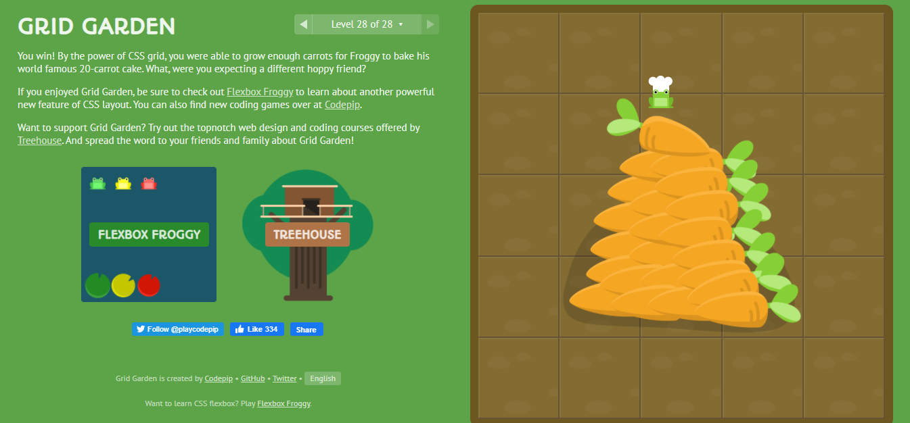

 ## Responsive design with CSS Grid

 - **grid** – generates a block-level grid
   - **inline-grid** – generates an inline-level grid
- **grid-template-columns & grid-template-rows:** Defines the columns and rows of the grid with a space-separated list of values. The values represent the track size, and the space between them represents the grid line.   
   - **```markdown<track-size>```** – can be a length, a percentage, or a fraction of the free space in the grid (using the fr unit)
   - **```markdown<line-name>```** – an arbitrary name of your choosing
   - **```<track-size>```** – can be a length, a percentage, or a fraction of the free space in the grid (using the fr unit)
   - **```<line-name>```** – an arbitrary name of your choosing
- **grid-template-areas:** Defines a grid template by referencing the names of the grid areas which are specified with the grid-area property. 
   -  **```markdown<grid-area-name>```** – the name of a grid area specified with grid-area
   -  **```<grid-area-name>```** – the name of a grid area specified with grid-area
   - **.** – a period signifies an empty grid cell
   - **none** – no grid areas are defined  
- **grid-template** A shorthand for setting grid-template-rows, grid-template-columns, and grid-template-areas in a single declaration.
   - **none** – sets all three properties to their initial values
   - **```markdown<grid-template-rows> / <grid-template-columns>```** – sets grid-template-columns and grid-template-rows to the specified values, respectively, and sets grid-template-areas to none
   - **```<grid-template-rows> / <grid-template-columns>```** – sets grid-template-columns and grid-template-rows to the specified values, respectively, and sets grid-template-areas to none


**Properties for the Children(Grid Items):**
- **grid-column-start, grid-column-end, grid-row-start, and grid-row-end:** Determines a grid item’s location within the grid by referring to specific grid lines. grid-column-start/grid-row-start is the line where the item begins, and grid-column-end/grid-row-end is the line where the item ends.
   - **```markdown<line>```** – can be a number to refer to a numbered grid line, or a name to refer to a named grid line
   - **span ```markdown<number>```** – the item will span across the provided number of grid tracks
   - **span ```markdown<name>```** – the item will span across until it hits the next line with the provided name
   - **```<line>```** – can be a number to refer to a numbered grid line, or a name to refer to a named grid line
   - **span ```<number>```** – the item will span across the provided number of grid tracks
   - **span ```<name>```** – the item will span across until it hits the next line with the provided name
   - **auto** – indicates auto-placement, an automatic span, or a default span of one
- **grid-column, and grid-row:** Shorthand for grid-column-start + grid-column-end, and grid-row-start + grid-row-end, respectively.
   - **```markdown<start-line> / <end-line>```** – each one accepts all the same values as the longhand version, including span
   - **```<start-line> / <end-line>```** – each one accepts all the same values as the longhand version, including span
- **grid-area:** Gives an item a name so that it can be referenced by a template created with the grid-template-areas property. 
    - **```markdown<name>```** – a name of your choosing
    - **```markdown<row-start> / <column-start> / <row-end> / <column-end>```** – can be numbers or named lines
    - **```<name>```** – a name of your choosing
    - **```<row-start> / <column-start> / <row-end> / <column-end>```** – can be numbers or named lines
- **justify-self:** Aligns a grid item inside a cell along the inline (row) axis (as opposed to align-self which aligns along the block (column) axis). This value applies to a grid item inside a single cell.
    - **start** – aligns the grid item to be flush with the start edge of the cell
    - **end** – aligns the grid item to be flush with the end edge of the cell


    ## CSS Garden tutorial :
    I finished all 28 levels 
    
