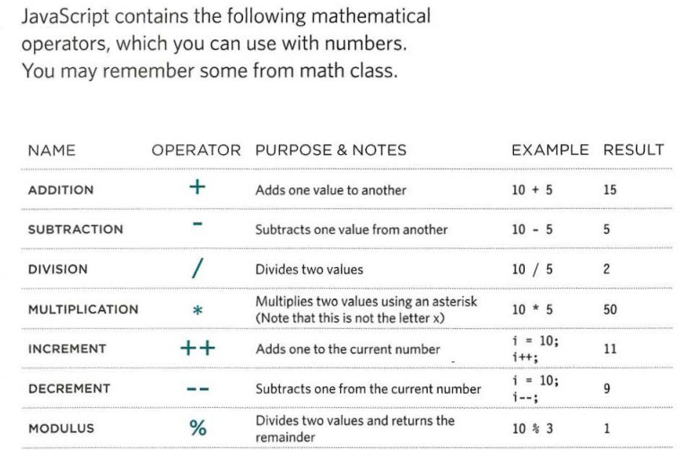

# JavaScript
 JavaScript can be used in browsers to make websites more interactive, interesting, and user-friendly.
## But how is that happen?
Access the content of the page Modify the content of the page Program rules or instructions the browser can follow React to events triggered by the user or browser.

### EXAMPLES OF JAVASCRIPT IN THE BROWSER
* SLIDESHOWS
* FRELOAD PART OF PAGEORMS
* FILTERING DATA

## EXPRESSIONS

An expression evaluates into (results in) a single value. Broadly speaking there are two types of expressions.
When you first declare a variable using the **Var** keyword, it is given a special value of undefined which has adata type like a number, string, or Boolean
•	EXPRESSIONS THAT JUST ASSIGN A VALUE TO A VARIABLE
•	EXPRESSIONS THAT USE TWO OR MORE VALUES TO RETURN A SINGLE VALUE

## OPERATORS
Expressions rely on things called operators; they allow programmers to create a single value from one or more values.
•	ASSIGNMENT OPERATORS Assign a value to a variable
•	COMPARISON OPERATORS Compare two values and return true or false
•	LOGICAL OPERATORS Combine expressions and return true or false
•	STRING OPERATORS Combine two strings, There is just one string operator: the+ symbol. It is used to join the strings on either side of it.

## WHAT IS A FUNCTION?

Functions let you group a series of statements together to perform a specific task. If different parts of a script repeat the same task, you can reuse the function (rather than repeating the same set of statements)

