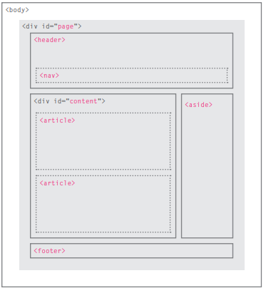
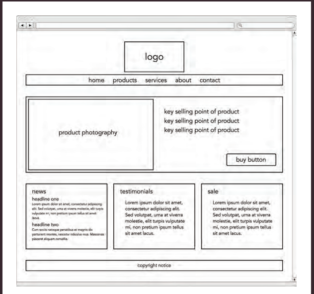

#  Introductory HTML and JavaScript

## Structure web pages with HTML

### What is HTML?
 

* HyperText Markup Language
* Tells the browser WHAT the content is
### HTML Tags
* There are opening tags
* There are closing tags
* And there are self-closing tags

### New Html5 Layout Elements

#### HTML elements
 Each HTML element tells the browser something about the information that sits between its opening and closing tags.

##### < head >

 

Before the < body > element you will often see a <head> element. This contains information
about the page . You will usually find a < title >
element inside the < head > element. The contents of the   < title > element are either shown in the top of the browser, above where you usually type in the URL of the page you want to visit, or
on the tab for that page
 
>`<head>`
 >` <title>Title of the document</title>`
> `</head>`
 

##### < body >
You met the < body > element Everything inside this element is shown inside the main browser window. you can insert this element to orgnize the body
> `<body>`
  `<h1>This is a heading</h1>`
  `
This is a paragraph.
`
>`</body>`

###### Headers & Footers

The < header > and < footer > elements can be used for:
* The main header or footer that appears at the top or bottom of every page on the
site.

* The < header > element used to contain the site
name and the main navigation.
* The < footer > element contains copyright information, along with links to the privacy policy and terms and conditions.

##### Other elements
* The < nav > element is used to contain the major navigational blocks on the site such as the
primary site navigation.

 
e.g

>nav {
 > display: block;
>}

 

*  < a > Linking Around Block-Level Elements allows you to turn an entire block into a link.If the `<a>` tag has no href attribute, it is only a placeholder for a hyperlink.

 

`<a href="https://engnour94.github.io/reading-note">Reading notes by Nour</a>`

 

### Extra Markup

#### DOCTYPEs
Because there have been several versions of HTML, each web page should begin with a DOCTYPE declaration to tell a browser which version of HTML the page is using
DOCTYPES tell browsers which version of HTML you
are using.
for HTML5
`<!DOCTYPE html>`
#### Comments
If you want to add a comment to your code that will not be visible in the user's browser, you
can add the text between these characters:
`<!-- -->`
#### Block Elements

Some elements will always appear to start on a new line in the browser window. These are known as block level elements. 
Examples of block elements are
`<h1>, 
, <ul>, and <li>`
 

#### Inline Elements

Some elements will always appear to continue on the same line as their neighbouring elements. These are known as inline elements.

 

`<a>, <b>, <em>, and .` 

#### Escape Characters
There are also special codes that can be used to show symbols such as copyright and trademark, currency symbols, mathematical characters, and
some punctuation marks

 
## Process & Design

* It's important to understand who your target audience is, why they would come to your site, what information they want to find and when they are likely to return.
* Site maps allow you to plan the structure of a site.
* Wireframes allow you to organize the information that will need to go on each page. 

* Design is about communication. Visual hierarchy helps visitors understand what you are trying to tell them.
* You can differentiate between pieces of information using size, color, and style.
* You can use grouping and similarity to help simplify the information you present.

## JavaScript
 JavaScript can be used in browsers to make websites more interactive, interesting, and user-friendly.
### But how is that happen?
Access the content of the page Modify the content of the page Program rules or instructions the browser can follow React to events triggered by the user or browser.

#### EXAMPLES OF JAVASCRIPT IN THE BROWSER
* SLIDESHOWS
* FRELOAD PART OF PAGEORMS
* FILTERING DATA

#### The ABC of programming:

You need to become familiar with some key concepts in computer programming. They will be covered in three sections: ABC

##### (**A**) What is a script and how do I create one?
* A script is a series of instructions that the computer can follow in order to achieve a goal.
* Each time the script runs, it might only use a subset of all the instructions.
* Computers approach tasks in a different way than
humans, so your instructions must let the computer
solve the task prggrammatically.
* To approach writing a script, break down your goal into
a series of tasks and then work out each step needed
to complete that task (a flowchart can help).  
 

##### (**B** ) How do computers fit in with the world around them? 
* Computers create models of the world using data. 
* The models use objects to represent physical things. 
Objects can :have properties that tell l JS about 
the object; methods that perform tasks using the 
properties of that object; events which are triggered 
when LISer interacts with the computer. 
* Programmers Can write code to Say When" this event 
,OCCUrS run that code. 
* Web browsers use HTML markup to create a model 
of the web .page Each element creates its own node 
(which is a kind of object). 
* To make web pages ,interactive you write code that 
USeS the browser s' model of the web page. 
##### **C** How do I write a script for a web page?
* It is best to keep JavaScript code in its own JavaScript file. JavaScript files are text files (like HTML pages and CSS style sheets), but they have the . j s extension.
* The HTML `<script>` element is used in HTML pages
to tell the browser to load the JavaScript file (rather like the `<link>` element can be used to load a CSS file).
* If you view the source code of the page in the browser, the JavaScript will not have changed the HTML,
because the script works with the model of the web
page that the browser has created. 

