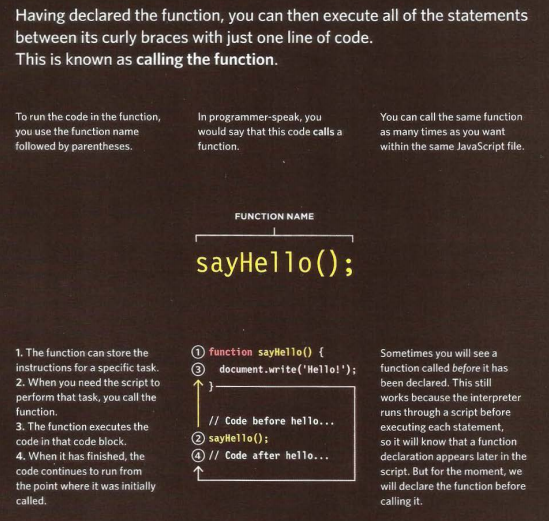

# FUNCTION

## WHAT IS A FUNCTION?

Functions let you group a series of statements together to perform a specific task. If different parts of a script repeat the same task, you can reuse the function (rather than repeating the same set of statements). 

## Declaring a fanction

## Caling a function

##  A function statement

A function statement starts with the function keyword. It can return a primitive type value, object, or another function. For example, a function statement can return an object as shown in the following code example:
 

>function getProduct(){
    let product = {
        Id:1,
        Title:'Book',
        Price: 30
    };
    return product; 
}
let p1 = getProduct();
>console.log(p1); // prints product object

 

## A Function as an Expression

A function as an expression can be created as shown in the following code example.
>let add = function a(num1,num2){
    let sum = num1+ num2; 
    return sum;
}
let res = add(8,9);
>console.log(res);// 17
